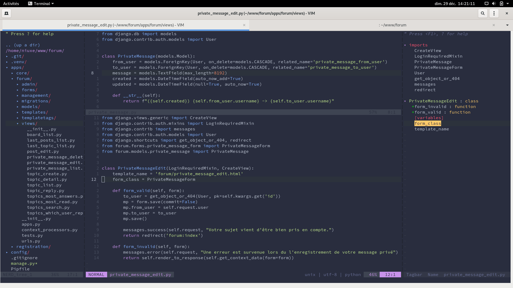

vim-config
ma config vim


Pour installer : 
- taper cette commande dans le terminal : 
```
git clone https://github.com/VundleVim/Vundle.vim.git ~/.vim/bundle/Vundle.vim
```
- ouvrir vim
- entrer cette commande :
```shell
:PluginInstall
```
- Pour installer YouCompleteMe, il faut installer les dépendances (ne pas oublier d'installer nodejs) :
```shell
# apt install build-essential cmake python3-dev
# apt-get install exuberant-ctags
$ cd ~/.vim/bundle/YouCompleteMe/
$ python3 install.py --clang-completer
```
- pour bénéficier d'un vrai copier/coller, il faut installer gvim:
```shell
# apt-get install vim-gtk3
```
- sortir de vim
- relancer vim


